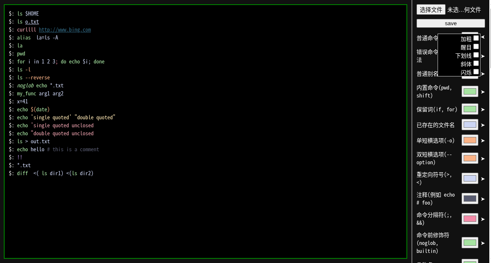

<!--
 * @encode: utf-8
 * @Date: 2026-01-02 17:21:21
 * @LastEditTime: 2026-01-02 23:18:54
 * @FilePath: /easy-set-zsh-highlighting/source/README.md
-->
## easy-set-zsh-highlighting
该项目是为了在网页上轻松设计出自己满意的`zsh-highlighting`配置文件
右上角的`选择文件`是导入已有的配置
`save`是保存当前调整好的配置

右边可以调整字体`颜色`,`加粗`等选项
左边终端为预览



## 使用

1. 可以直接使用浏览器打开`mter.html`

2. 或者本地开启`http服务`访问:
```
git clone https://github.com/tiandic/easy-set-zsh-highlighting.git
cd easy-set-zsh-highlighting
python3 -m http.server
```
然后访问 <http://127.0.0.1:8000/mter.html> 即可

<http://127.0.0.1:8000/help.html> 有简单的帮助信息